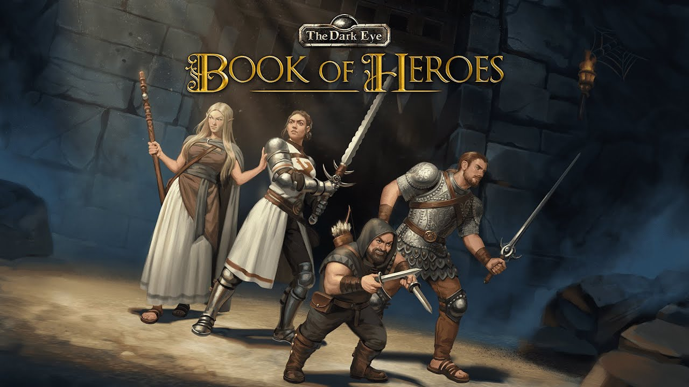

# The Dark Eye: Book of Heroes
## Random Potion, 2018-2020

### Role: Junior Gameplay Programmer
### Project type: Isometric 3D multiplayer roleplaying game, Windows

The project had been ongoing for some time already when I joined the team at Random Potion, but I had no issue jumping into it and getting myself familiarized with the codebase.

### 1st year
* Small UI, AI pathing and decision making, and character ability fixes
* Implementation of new character abilities
* Improving existing in-game events called encounters
* Creating new encounter variations of existing ones
* Implementation of traps and other consumables
* Tweaks to procuderal generation of encounters

### 2nd year
* Designing and implementation of new, more complex encounters including multi-step puzzles and traps
* A simplified dialogue system with multiple dialogue options and outcomes
* A complete overhaul of the character creation
* Implementation of The Dark Eye professions, including all active spells and chants, combat abilities and special abilities
* Creation of Unity Editor tools to automatize and streamline asset creation for consumables, weapons, armor etc

### The final 6 months
* Implementation of The Dark Eye passive advantages and disadvantages
* Implementation of The Dark Eye specific special abilities for enemies
* Implementation of multiple character storyline-specific encounters
* Two months of QA; playing through all adventures, storylines and encounters with all possible character combinations, and fixing the issues I'd find

## Links & Videos

<iframe src="https://store.steampowered.com/widget/1139870/" frameborder="0" width="646" height="190"></iframe>